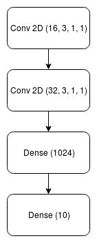
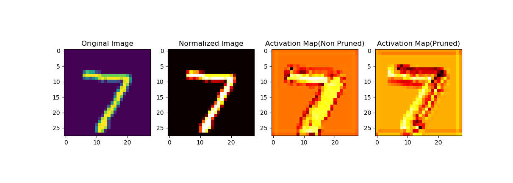

# compression
## A compressed MNIST classifier

This repository implements a version of filter pruning similar to ["PRUNING CONVOLUTIONAL NEURAL NETWORKS FOR RESOURCE EFFICIENT INFERENCE"](https://arxiv.org/pdf/1611.06440.pdf), albeit in a bit more primitive fashion. The goal is to create a small MNIST classifier with inference speed in mind and **not** the model disk size itself (however, the model disk size is also reduced as a side effect). We will start by establishing a baseline.

Base numbers for the model defined as "Net" are:

|  |  |
| ------------- | ------------- |
| **Training Accuracy**  | 99.1 %  |
| **Validation Accuracy**  | 97.9 %   |
| **FPS** | 145 |
| **FLOPS**| 29,438,464 |

The network was trained on GPU for 20 epochs with a learning rate of 0.001 but all of the evaluation was done on the CPU. The architecture of the network is as follows:

    

* Conv 2D(Filters, Kernel Size, Stride, Padding)  
** Dense (Neurons)

System Configuration:

1. **Platform**: Ubuntu 16.04
2. **Processor**: Intel i7-8700k
3. **RAM**: 16 GB
4. **Library**: PyTorch

## Related work
---------------
There has been a lot of work around neural network compression which can be classified into four categories:

1. **Weight Pruning**: 
   * This form of pruning aims to reduce the number of neural network connections. 
   * From an implementation aspect, it essentially means that we set the weights of certain connections to zero
   * This, however, has its own problems which we will see later.

2. **Filter Pruning**:
   * This approach is useful when using a form of Convolution networks 
   * This by far is the easiest to implement once you know which filters to eliminate
   * We will follow this approach in this repository

3. **Quantization**:
   * This reduces the precision of the model parameters usually from FP32 to INT 8
   * Faster and a reduced footprint but inaccurate as one can imagine 

4. **Huffman Encoding**:
   * Not really a model optimizer in terms of inference speed. 
   * It mainly encodes the models weights to reduce the footprint on the hard disk

## Our Approach
---------------
We use a form of filter pruning discussed in the paper linked above. This methodology essentially eliminates filters from all the convolution layers in the network. We have just two convolution layers in our network from which we will eliminate one filter after another till the drop in accuracy is not acceptable anymore.

First, comes the selection criteria or the so called "sensitivity analysis". We are trying to figure out which filters are the least important in the network or in other words which filters is the network least "sensitive" towards. There are multiple ways of evaluating this but in the paper they use "Taylor expansion" to gauge the difference in loss likely to occur when a filter in question is removed. Whichever filter has the least impact on the loss, therefore, is the least important. We could implement it by brute forcing and evaluating losses when every filter is removed. In this repository, this method is **not** implemented since the development of such would take time.

Instead, we simply apply L2 Normalization to each filter and remove the filter with the minimum value each time which is easier to do. After removing each filter, we train the model for 10 more epochs at a learning rate of 0.001 to achieve convergence.

We first remove the weights of the first convolution layer yeilding the following results.

#### Convolution 1 Pruning Results 
| Number of filters pruned | Training   Accuracy | Testing   Accuracy | FPS | FLOPs | Model disk size | 
| :----------------------: | :------: | :-----: | :-: | :---: | :-------------: |
| 2 | 99.6 % | 97.6 % | 145 | 28.9M | 102 MB |
| 4 | 99.6 % | 97.9 % | 147 | 28.5M | 102 MB |
| 8 | 99.5 % | 97.9 % | 145 | 27.5M | 102 MB |
| 12 | 99.4 % | 97.7 % | 147 | 26.5M | 102 MB |
| 15 | 97.2 % | 94.1 % | 150 | 25.9M  | 102 MB |

So what's happening here? Why is there only a reduction of 4 million FLOPs when there is a reduction of 15 out of 16 filters? This is because the weights matrix of shapes [16, 1, 3, 3] (Conv 2D - 1) and [32, 16, 3, 3] (Conv 2D - 2) reduce by only 297 parameters everytime a filter from the first layer is deducted.

#### Convolution 2 Pruning Results
| Number of filters pruned | Training   Accuracy | Testing   Accuracy | FPS | FLOPs | Model disk size | 
| :----------------------: | :------: | :-----: | :-: | :---: | :-------------: |
| 4 | 97.8 % | 97.6 % | 155 | 25M | 90 MB |
| 8 | 98.0 % | 96.8 % | 193 | 22M | 77 MB |
| 16 | 97.8 % | 96.5 % | 266 | 14M | 51 MB |
| 24 | 97.0 % | 95.9 % | 580 | 7.4M | 26 MB |
| 30 | 96.7 % | 96.3 % | 2770 | 1.9M | 6.5 MB |
| 31 | 95.4 % | 94.5 % | 3427 | 1M | 3.3 MB |

In contrast, since the second convolution layer is connected to a FC layer, a single filter reduction results in a reduction of 800,000 parameters. Its more effective to reduce parameters in this layer.

#### Convolution 1 + Convolution 2 Pruning Results
| Number of filters  pruned(C1, C2) | Training   Accuracy | Testing   Accuracy   | FPS | FLOPs | Model disk size | 
| :----------------------: | :------: | :-----: | :-: | :---: | :-------------: |
| 15, 31 | 92.5 % | 91.8 % | 4000 | 0.8M | 3.3 MB |
| 12, 31 | 95.6 % | 95.2 % | 4000 | 0.87M | 3.3 MB |
| 8, 31 | 95.9 % | 95.5 % | 3700 | 0.9M | 3.3 MB |
| 6, 31 | 95.9 % | 95.5 % | 3700 | 0.9M | 3.3 MB |
| 4, 31 | 96.0 % | 94.8 % | 3800 | 1M | 3.3 MB |
| 15, 30 | 96.5 % | 95.5 % | 3300 | 1.6M | 6.5 MB |
| 12, 30 | 97.3 % | 96.0 % | 3300 | 1.7M | 6.5 MB |

That's exactly what we do in the final pruning stage. We try to prune as much of the last layer as we can while varying the pruning in the first layer to achieve the optimum network.

Why not go for other approaches?

1. **Weight pruning**: This approach while potentially very effective is not very viable at least in PyTorch due to the way networks are implemented. Even if we zero out some of the weights and stop the gradient update by explicitly making the gradient zero, the computation still happens. The multiplication with zero still happens and ultimately there is no improvement in the inference time.
2. **Quantization**: This is not really algorithmic. It is exploiting the compute hardware's properties which can vary drastically from machine to machine.
3. **Huffman Encoding**: We don't really care about this since out aim is not to reduce model footprint in terms of disk size.

## Results
-------------

| | Base | Pruned | Improvement |
|-| :--: | :----: | :---------: |
| Parameters | 29.4 M | 1.7 M | 17x &darr; |
| FPS | 145 | 3300 | 22x &uarr; |
| Model Disk Size | 102 MB | 6.5 MB | 15x &darr; |

But how do we know if the neural network is actually learning anything? Activation maps!

    

## Future enhancements
----------------------
1. For a real world scenario i.e. for deploying on mobiles, drones or other low power systems quatization could in fact be a very viable solution.
2. These numbers could be further improved if run on a GPU
3. Furthermore, the current code will not work well for deeper networks. These networks would require a much more sophisticated selection process like the Taylor expansion to really know the importance of the network.
4. The problem of eliminating filters could become an optimization problem where we gradually move from most agressive combined pruning to least agressive as done in Table 3.

NOTE: 

1. The model files are not uploaded since each of them is around a 102 MB.
2. The code has not been formatted correctly (Will be improved later)